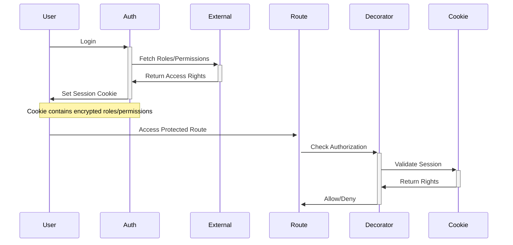

# Session-Based Authorization 🍪

## Overview

Storing roles and permissions in encrypted session cookies for fast, stateless authorization checks while maintaining security.



## Session Implementation

```typescript
// auth/session.server.ts
import { createCookieSessionStorage } from '@remix-run/node';

interface SessionData {
    userId: string;
    roles: string[];
    permissions: string[];
    email: string;
}

export const sessionStorage = createCookieSessionStorage<SessionData>({
    cookie: {
        name: '__session',
        httpOnly: true,
        path: '/',
        sameSite: 'lax',
        secrets: [process.env.SESSION_SECRET],
        secure: process.env.NODE_ENV === 'production',
    },
});

export async function createUserSession({
    userId,
    roles,
    permissions,
    email,
}: SessionData) {
    const session = await sessionStorage.getSession();
    session.set('userId', userId);
    session.set('roles', roles);
    session.set('permissions', permissions);
    session.set('email', email);

    return session;
}
```

## Authorization Decorator

```typescript
// auth/decorators.ts
export function Authorized(roles: string[] = [], permissions: string[] = []) {
    return function (
        target: any,
        propertyKey: string,
        descriptor: PropertyDescriptor
    ) {
        const originalMethod = descriptor.value;

        descriptor.value = async function (...args: any[]) {
            const request = args[0]?.request;
            if (!request) throw new Error('No request object found');

            const session = await sessionStorage.getSession(
                request.headers.get('Cookie')
            );

            // Check if session exists
            if (!session.has('userId')) {
                throw redirect('/login');
            }

            const userRoles = session.get('roles') as string[];
            const userPermissions = session.get('permissions') as string[];

            // Check roles
            const hasRole =
                roles.length === 0 ||
                roles.some((role) => userRoles.includes(role));

            // Check permissions
            const hasPermissions =
                permissions.length === 0 ||
                permissions.every((permission) =>
                    userPermissions.includes(permission)
                );

            if (!hasRole || !hasPermissions) {
                throw json(
                    {
                        message: 'Unauthorized',
                        requiredRoles: roles,
                        requiredPermissions: permissions,
                    },
                    { status: 403 }
                );
            }

            return originalMethod.apply(this, args);
        };

        return descriptor;
    };
}
```

## Login Handler

```typescript
// routes/login.tsx
export async function action({ request }: ActionArgs) {
    const form = await request.formData();
    const email = form.get('email');
    const password = form.get('password');

    // Authenticate user
    const user = await authenticateUser(email, password);

    if (!user) {
        return json({ error: 'Invalid credentials' }, { status: 400 });
    }

    // Fetch roles and permissions from external service
    const { roles, permissions } = await fetchUserAccess(user.id);

    // Create session with access rights
    const session = await createUserSession({
        userId: user.id,
        email: user.email,
        roles,
        permissions,
    });

    return redirect('/dashboard', {
        headers: {
            'Set-Cookie': await sessionStorage.commitSession(session),
        },
    });
}
```

## Session Refresh

```typescript
// auth/refresh.server.ts
export async function refreshSession(request: Request) {
    const session = await sessionStorage.getSession(
        request.headers.get('Cookie')
    );

    if (!session.has('userId')) {
        return null;
    }

    // Periodically refresh roles/permissions
    const lastRefresh = session.get('lastRefresh');
    if (!lastRefresh || Date.now() - lastRefresh > 15 * 60 * 1000) {
        const userId = session.get('userId');
        const { roles, permissions } = await fetchUserAccess(userId);

        session.set('roles', roles);
        session.set('permissions', permissions);
        session.set('lastRefresh', Date.now());

        return session;
    }

    return null;
}
```

## Root Loader

```typescript
// root.tsx
export async function loader({ request }: LoaderArgs) {
    // Check for session refresh
    const refreshedSession = await refreshSession(request);

    if (refreshedSession) {
        return json(
            { ok: true },
            {
                headers: {
                    'Set-Cookie': await sessionStorage.commitSession(
                        refreshedSession
                    ),
                },
            }
        );
    }

    return json({ ok: true });
}
```

## Usage Example

```typescript
// routes/settings/categories.tsx
@Authorized(['admin'], ['settings.manage'])
export default function CategoriesRoute() {
    return <SimpleCrudList {...props} />;
}

// routes/cells/$id.tsx
@Authorized(['cell_leader', 'temp_leader'], ['attendance.manage'])
export async function loader({ request, params }: LoaderArgs) {
    const session = await sessionStorage.getSession(
        request.headers.get("Cookie")
    );

    // Access session data if needed
    const userId = session.get("userId");

    return json({ /* cell data */ });
}
```

## Security Considerations

1. **Cookie Settings**

```typescript
const cookieOptions = {
    httpOnly: true,      // No JS access
    secure: true,        // HTTPS only
    sameSite: "lax",     // CSRF protection
    secrets: [...],      // Multiple rotation keys
    maxAge: 3600        // 1 hour expiry
};
```

2. **Session Invalidation**

```typescript
export async function invalidateSession(request: Request) {
    const session = await sessionStorage.getSession(
        request.headers.get('Cookie')
    );

    return redirect('/login', {
        headers: {
            'Set-Cookie': await sessionStorage.destroySession(session),
        },
    });
}
```

3. **Rights Verification**

```typescript
// Periodically verify against source of truth
export async function verifySessionRights(session: Session) {
    const { roles, permissions } = await fetchUserAccess(session.get('userId'));

    const currentRoles = session.get('roles');
    const currentPermissions = session.get('permissions');

    return (
        JSON.stringify(roles) === JSON.stringify(currentRoles) &&
        JSON.stringify(permissions) === JSON.stringify(currentPermissions)
    );
}
```

---

# Cell Leader Authorization Examples 🔑

## Session Structure

```typescript
// Example of cell leader session data
const cellLeaderSession = {
    userId: '123',
    email: 'leader@church.org',
    roles: ['cell_leader'],
    permissions: [
        'attendance.manage',
        'members.view',
        'members.manage',
        'prayer.manage',
        'resources.view',
        'giving.record',
    ],
    metadata: {
        cellId: 'cell_456',
        name: 'John Doe',
    },
};
```

## Protected Routes

```typescript
// routes/_app.tsx (Layout)
export default function AppLayout() {
    return (
        <div>
            <Sidebar>
                {/* Only show links based on permissions */}
                <NavLink to="/dashboard">Dashboard</NavLink>

                {/* Cell Management - Only for cell leaders */}
                <ProtectedLink
                    to="/cell"
                    roles={["cell_leader", "temp_leader"]}
                >
                    Cell Management
                </ProtectedLink>

                {/* Members - View vs Manage */}
                <ProtectedLink
                    to="/members"
                    permissions={["members.view", "members.manage"]}
                >
                    Members
                </ProtectedLink>

                {/* Settings - Admin only */}
                <ProtectedLink
                    to="/settings"
                    roles={["admin"]}
                >
                    Settings
                </ProtectedLink>
            </Sidebar>
        </div>
    )
}

// routes/cell.tsx - Cell Management
@Authorized(["cell_leader", "temp_leader"])
export default function CellRoute() {
    return (
        <Tabs defaultValue="attendance">
            <TabsList>
                <TabsTrigger value="attendance">Attendance</TabsTrigger>
                <TabsTrigger value="members">Members</TabsTrigger>
                <TabsTrigger value="giving">Giving</TabsTrigger>
            </TabsList>

            <TabsContent value="attendance">
                <AttendanceManager />
            </TabsContent>

            <TabsContent value="members">
                <MembersList />
            </TabsContent>

            <TabsContent value="giving">
                <GivingRecords />
            </TabsContent>
        </Tabs>
    )
}

// routes/cell.attendance.tsx
@Authorized(["cell_leader", "temp_leader"], ["attendance.manage"])
export async function action({ request }: ActionArgs) {
    const formData = await request.formData();
    const intent = formData.get("intent");

    switch (intent) {
        case "mark-attendance":
            return handleAttendance(formData);
        case "edit-record":
            return editAttendanceRecord(formData);
        default:
            return json({ error: "Invalid action" }, { status: 400 });
    }
}
```

## Protected Actions Example

```typescript
// routes/cell.members.tsx
@Authorized(["cell_leader"])
export default function CellMembers() {
    const { members } = useLoaderData<typeof loader>();
    const fetcher = useFetcher();

    return (
        <div className="space-y-4">
            <div className="flex justify-between">
                <h2>Cell Members</h2>

                {/* Only show add if has permission */}
                <ProtectedButton
                    permissions={["members.manage"]}
                    onClick={() => setShowAdd(true)}
                >
                    Add Member
                </ProtectedButton>
            </div>

            <div className="divide-y">
                {members.map(member => (
                    <div key={member.id} className="py-2">
                        <div className="flex justify-between">
                            <div>{member.name}</div>

                            <div className="flex gap-2">
                                {/* View allowed for all */}
                                <Button variant="ghost" asChild>
                                    <Link to={`/members/${member.id}`}>
                                        View
                                    </Link>
                                </Button>

                                {/* Edit only with manage permission */}
                                <ProtectedButton
                                    permissions={["members.manage"]}
                                    onClick={() => handleEdit(member)}
                                >
                                    Edit
                                </ProtectedButton>
                            </div>
                        </div>
                    </div>
                ))}
            </div>

            {/* Protected Forms */}
            <ProtectedForm
                permissions={["members.manage"]}
                action="/api/members"
                method="post"
            >
                <input type="hidden" name="cellId" value={cellId} />
                {/* form fields */}
            </ProtectedForm>
        </div>
    );
}
```

## Protected Components

```typescript
// components/blocks/cell-actions.tsx
export function CellActions({ cellId }: { cellId: string }) {
    const { roles, permissions } = useAuth();
    const fetcher = useFetcher();

    return (
        <DropdownMenu>
            <DropdownMenuTrigger asChild>
                <Button variant="ghost">
                    <MoreVertical className="h-4 w-4" />
                </Button>
            </DropdownMenuTrigger>

            <DropdownMenuContent>
                {/* Basic actions any cell leader can do */}
                <DropdownMenuItem onClick={() => handleAttendance()}>
                    Take Attendance
                </DropdownMenuItem>

                <DropdownMenuItem onClick={() => handlePrayers()}>
                    Prayer Requests
                </DropdownMenuItem>

                {/* Protected actions */}
                {permissions.includes('members.manage') && (
                    <DropdownMenuItem onClick={() => handleMembers()}>
                        Manage Members
                    </DropdownMenuItem>
                )}

                {permissions.includes('giving.record') && (
                    <DropdownMenuItem onClick={() => handleGiving()}>
                        Record Giving
                    </DropdownMenuItem>
                )}

                {/* Admin only actions */}
                {roles.includes('admin') && (
                    <DropdownMenuItem
                        className="text-red-600"
                        onClick={() => handleDelete()}
                    >
                        Delete Cell
                    </DropdownMenuItem>
                )}
            </DropdownMenuContent>
        </DropdownMenu>
    );
}
```

## Error States

```typescript
// components/error-boundary.tsx
export function ErrorBoundary() {
    const error = useRouteError();

    // Authorization Errors
    if (error.status === 403) {
        return (
            <div className="flex flex-col items-center justify-center min-h-[400px]">
                <LockIcon className="h-12 w-12 text-muted-foreground" />
                <h3 className="mt-4 text-lg font-semibold">
                    Access Restricted
                </h3>
                <p className="text-sm text-muted-foreground mt-1">
                    You don't have permission to access this section
                </p>
                <Button asChild className="mt-4">
                    <Link to="/dashboard">Return to Dashboard</Link>
                </Button>
            </div>
        );
    }

    return <DefaultErrorBoundary error={error} />;
}
```

## Navigation Guards

```typescript
// components/protected-link.tsx
export function ProtectedLink({
    to,
    roles = [],
    permissions = [],
    children,
}: ProtectedLinkProps) {
    const { checkAccess } = useAuth();
    const hasAccess = checkAccess({ roles, permissions });

    if (!hasAccess) return null;

    return (
        <Link to={to} className="block px-4 py-2 hover:bg-accent">
            {children}
        </Link>
    );
}

// Usage in navigation
<nav className="space-y-1">
    <ProtectedLink
        to="/cell/attendance"
        roles={['cell_leader', 'temp_leader']}
        permissions={['attendance.manage']}
    >
        <CalendarIcon className="mr-2 h-4 w-4" />
        Attendance
    </ProtectedLink>

    <ProtectedLink
        to="/cell/members"
        roles={['cell_leader']}
        permissions={['members.view']}
    >
        <UsersIcon className="mr-2 h-4 w-4" />
        Members
    </ProtectedLink>

    {/* Only visible to admins */}
    <ProtectedLink to="/settings" roles={['admin']}>
        <SettingsIcon className="mr-2 h-4 w-4" />
        Settings
    </ProtectedLink>
</nav>;
```
