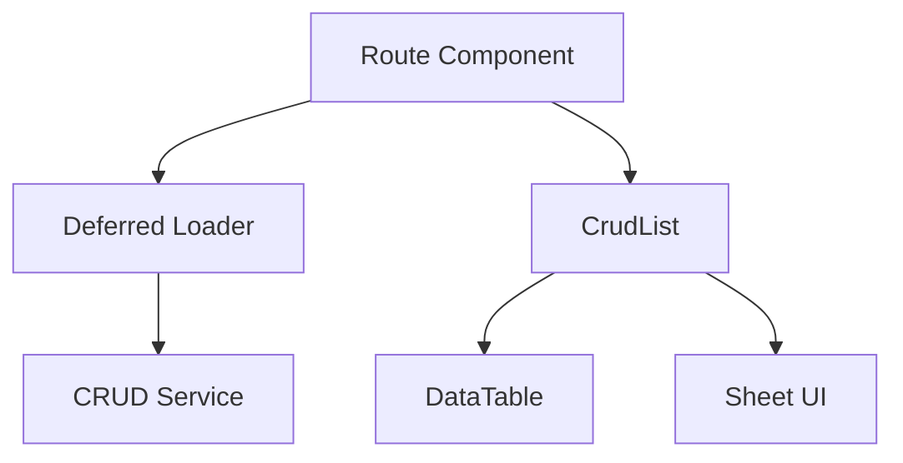

# 🚀 Remix CRUD Pattern

## 🎯 What's Going On Here?

**The Problem**
Building CRUD operations in Remix often leads to:

-   Duplicate code across models
-   Inconsistent UX patterns
-   Type safety gaps
-   Complex loader/action management

**The Solution 🎯**
A type-safe, reusable pattern combining:

-   Generic TypeScript components
-   Remix's defer/Await
-   shadcn/ui's Sheet component
-   Service abstractions



## 🧩 Core Components Explained

### 1. 📑 Route Component

```typescript
// The brain of the operation
export default function Contributors() {
    const { contributorsPromise } = useLoaderData<typeof loader>();

    return (
        <Suspense>
            <Await resolve={contributorsPromise}>
                {(contributors) => (
                    <CrudList
                        columns={columns}
                        data={contributors}
                        baseRoute="/contributors"
                        title="Contributors"
                    />
                )}
            </Await>
        </Suspense>
    );
}
```

👉 What's happening:

-   Uses deferred loading for better UX
-   Wraps data fetching in Suspense
-   Renders CRUD UI when data arrives

### 2. 🔄 Service Pattern

```typescript
// The data handler
interface ICrudService<TList, TCreateUpdate, TModel> {
    getAll(): Promise<TList[]>; // List view data
    getById(id: string): Promise<TModel>; // Single item
    create(item: TCU): Promise<TModel>; // Create new
    update(id: string, item: TCU): Promise<TModel>; // Update
    delete(id: string): Promise<void>; // Remove
}
```

👉 Why these types:

-   `TList`: Slim version for tables (performance)
-   `TCreateUpdate`: Shape of create/update forms
-   `TModel`: Complete data model

### 3. 🎨 Generic CRUD UI

```typescript
// The user interface
function CrudList<TL, TCU, TM, TS extends ICrudService<TL, TCU, TM>>({
    columns, // Table structure
    data, // Data to display
    baseRoute, // URL base
    title, // UI title
}: CrudListProps<TL>);
```

👉 Features:

-   Sheet-based CRUD operations
-   Automatic routing
-   Type-safe tables
-   Responsive design

## 📁 File Structure

```
/contributors
├── route.tsx              # 📋 Main list view
├── components/
│   ├── columns.tsx        # 📊 Table definition
│   └── forms/             # 📝 CRUD forms
├── create.tsx             # ➕ Create new
├── $id.edit.tsx          # ✏️ Edit existing
└── $id.view.tsx          # 👀 View details
```

## 🔒 Type Safety Example

```typescript
// 1. Define your types
type TPartialContributor = {
    id: string;
    name: string;
};

type TContributor = {
    id: string;
    name: string;
    email: string;
    // More fields...
};

// 2. Use in component
<CrudList<
    TPartialContributor, // 📋 List view (slim)
    TContributor, // ✏️ Create/Update (full)
    TContributor, // 📚 Complete model
    ContributorService // 🔄 Service implementation
>
    columns={columns}
    data={data}
    baseRoute="/contributors"
    title="Contributors"
/>;
```

## 🚨 Common Gotchas

1. Type Matching

```typescript
// ❌ Wrong
type ListType = { name: string }; // Missing id

// ✅ Right
type ListType = { id: string; name: string };
```

2. Service Implementation

```typescript
// ❌ Wrong
class Service {
    async getAll() { ... }  // Missing type implementation

// ✅ Right
class Service implements ICrudService<TL, TCU, TM> {
    async getAll(): Promise<TL[]> { ... }
```

3. Route Structure

```typescript
// ❌ Wrong
/contributors/deit /
    $id / // Incorrect order
    // ✅ Right
    contributors /
    $id /
    edit; // Correct order
```

## 🎯 Key Benefits

1. 🔒 Type Safety

    - Catch errors at compile time
    - Autocomplete support
    - Consistent data shapes

2. 🔄 Reusability

    - One pattern, many models
    - Consistent UI/UX
    - DRY code

3. 📱 UX Features

    - Deferred loading
    - Loading states
    - Sheet-based CRUD
    - Responsive design

4. 🛠️ Developer Experience
    - Clear patterns
    - Easy to extend
    - Self-documenting code
