# Cell Connect Documentation

## 📖 Contents

1. [Platform Overview](#platform-overview)
2. [Architecture](#architecture)
3. [Core Features](#core-features)
4. [User Flows](#user-flows)
5. [Data Models](#data-models)
6. [Access Control](#access-control)
7. [User Interface](#user-interface)
8. [Analytics & Reporting](#analytics--reporting)
9. [Technical Reference](#technical-reference)
10. [Cloud Architecture](#architecture)
11. [Support](#support)

## Platform Overview

### Purpose & Goals

Cell Connect streamlines cell-based ministry through digital tools that:

-   Simplify administrative tasks
-   Enhance member engagement
-   Support leadership development
-   Enable data-driven ministry decisions

### Key Features

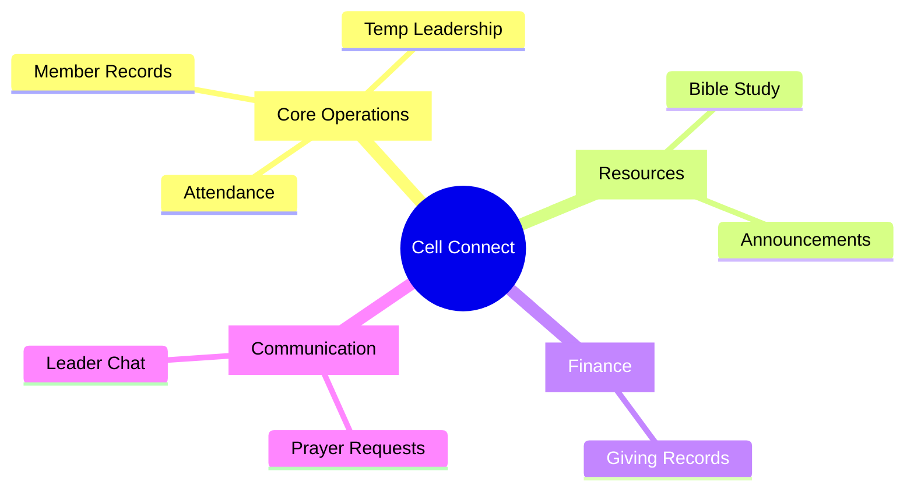

### User Types

| Role        | Primary Functions            | Access Level        |
| ----------- | ---------------------------- | ------------------- |
| Admin       | System management, reporting | Full access         |
| Cell Leader | Cell operations, member care | Cell-scoped access  |
| Temp Leader | Meeting facilitation         | Time-limited access |
| Member      | Personal engagement          | Basic access        |

### Common Use Cases

#### 1. Weekly Cell Operations

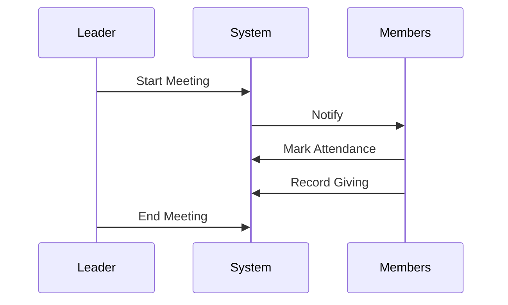

#### 2. Leadership Transition


#### 3. Member Journey

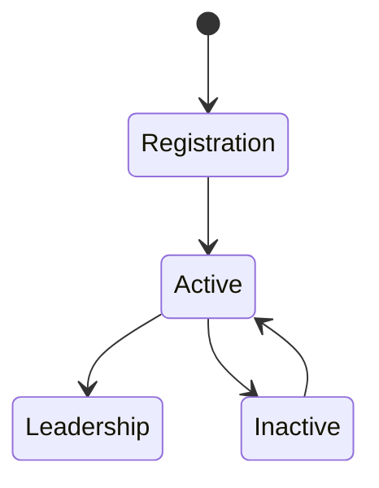

## Success Metrics

### Core Metrics

##### 1. Cell Health

-   **Weekly Attendance Rate**

    -   Present/Total Members ratio
    -   Consistency score
    -   New visitor retention

-   **Member Engagement**
    -   Prayer request frequency
    -   Study guide interaction
    -   Communication activity

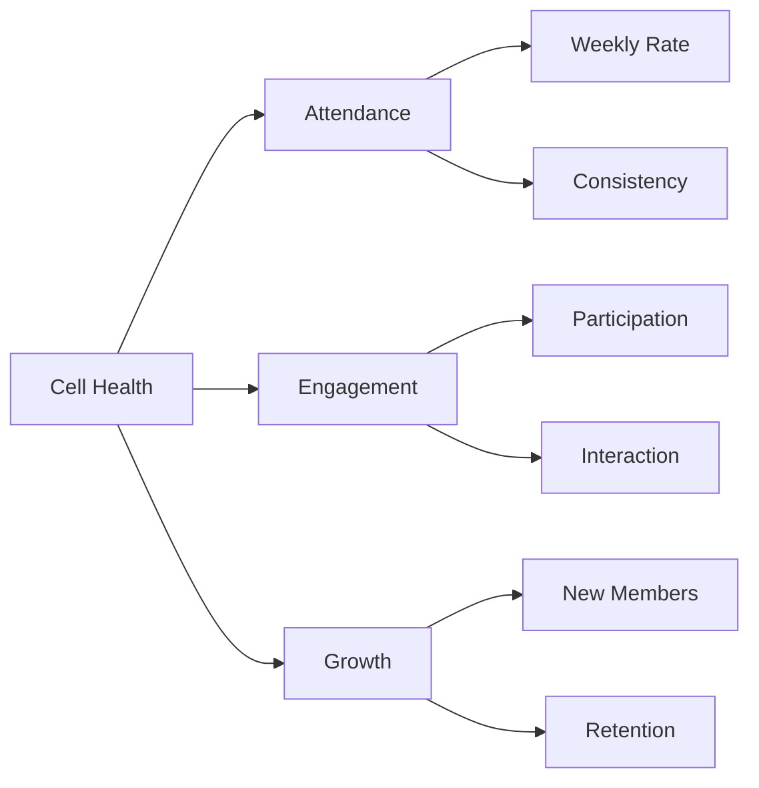

##### 2. Leadership Development

-   **Temporary Leadership**

    -   Assignment frequency
    -   Performance rating
    -   Member participation rate

-   **Training Completion**
    -   Resource utilization
    -   Feedback scores
    -   Implementation success

##### 3. Financial Health

-   **Giving Patterns**
    -   Transaction frequency
    -   Category distribution
    -   Growth trends

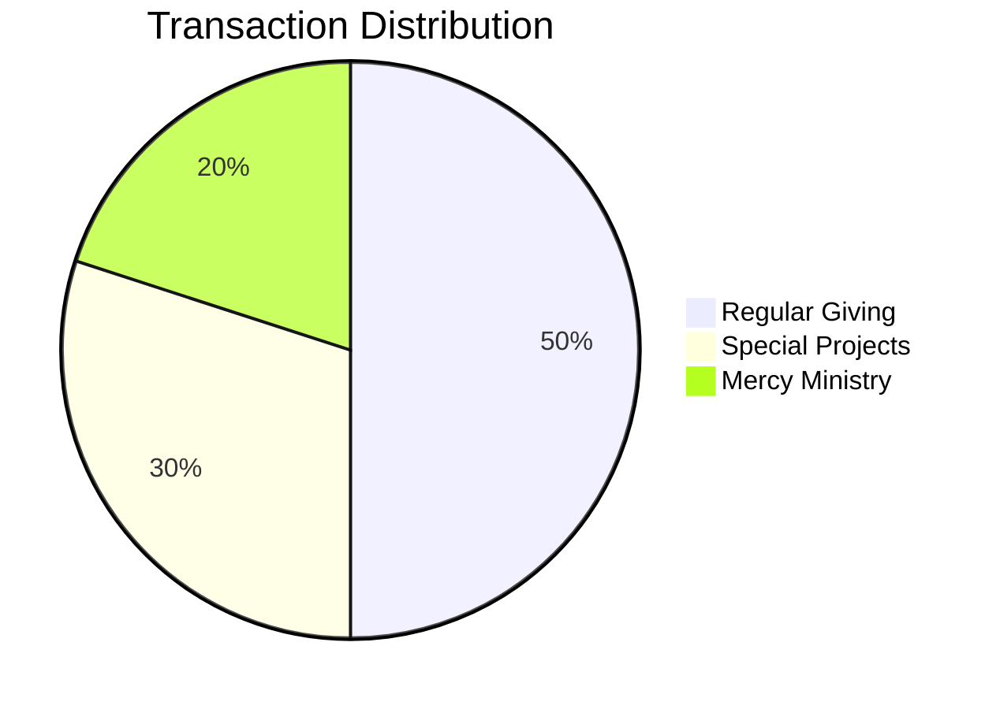

##### 4. Platform Adoption

-   **Feature Usage**

    -   Daily active users
    -   Feature engagement rates
    -   Mobile vs desktop usage

-   **System Health**
    -   Response time
    -   Error rates
    -   Sync success rate

### Reporting Dashboard

##### Weekly View

```typescript
type WeeklyMetrics = {
    attendance: {
        rate: number; // 0-100%
        consistency: number; // 0-100%
        newVisitors: number;
    };
    engagement: {
        prayerRequests: number;
        studyGuideViews: number;
        messagesSent: number;
    };
    giving: {
        totalTransactions: number;
        categorySplit: Record<string, number>;
    };
};
```

##### Monthly Trends

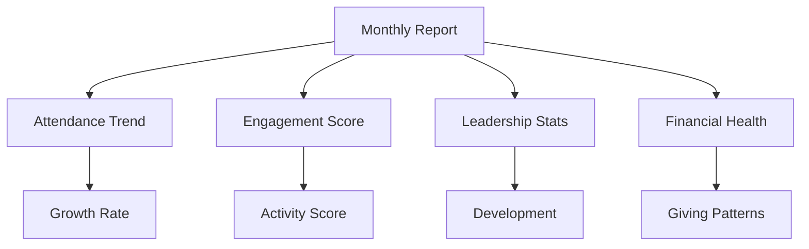

### Performance Targets

| Metric              | Target  | Warning   | Critical |
| ------------------- | ------- | --------- | -------- |
| Attendance Rate     | >80%    | 60-80%    | <60%     |
| Member Engagement   | >70%    | 50-70%    | <50%     |
| Leadership Rotation | Monthly | Quarterly | >Quarter |
| Platform Usage      | >90%    | 70-90%    | <70%     |

## Architecture

### High-Level Overview

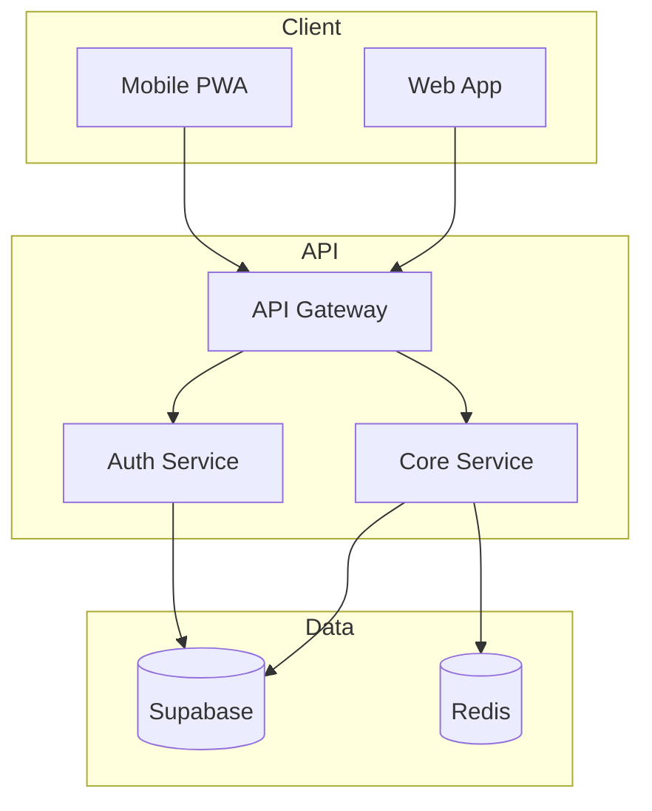

### Core Components

##### Frontend Architecture

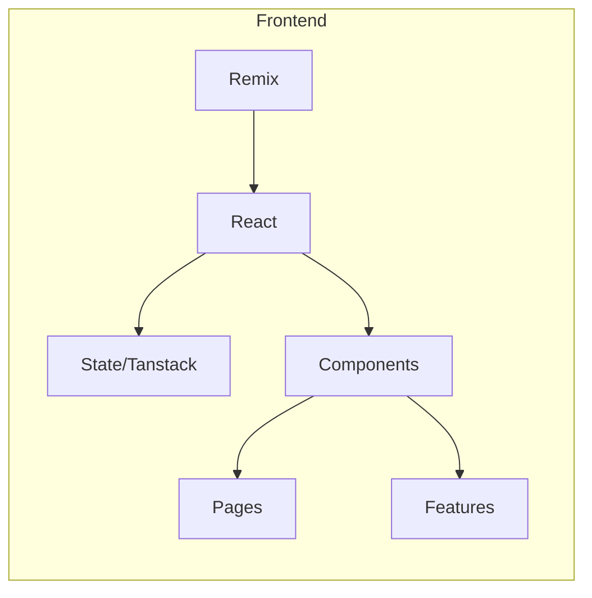

##### Data Architecture

```typescript
interface DataLayer {
    // Real-time Subscriptions
    attendance: RealtimeChannel;
    prayers: RealtimeChannel;
    announcements: RealtimeChannel;

    // Cached Data
    studyGuides: CacheConfig;
    memberProfiles: CacheConfig;

    // Offline Support
    syncQueue: Queue<Operation>;
}
```

### Security Model

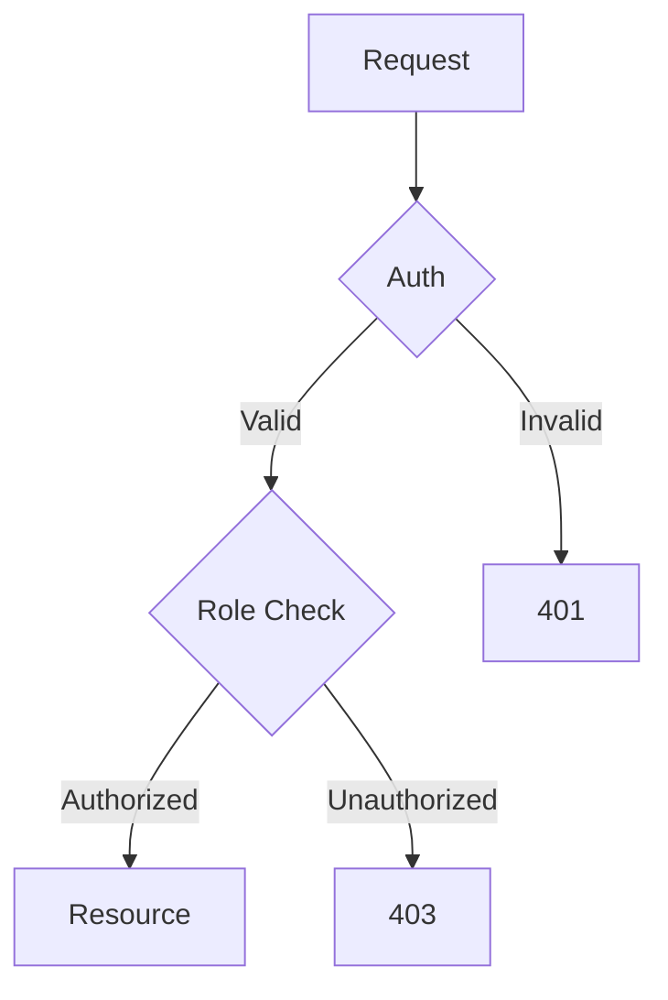

### Data Flow

##### Attendance Flow

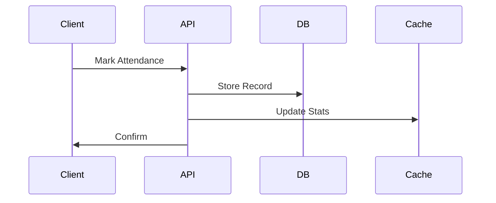

### System Components

##### 1. Frontend (Remix.js)

-   PWA capabilities
-   Offline first
-   Real-time updates

##### 2. API Layer

-   Supabase Functions
-   Edge Computing
-   Rate Limiting

##### 3. Database (Supabase)

-   Row Level Security
-   Real-time Subscriptions
-   Automated Backups

##### 4. Caching

```typescript
interface CacheStrategy {
    type: 'memory' | 'persistent';
    ttl: number;
    invalidation: 'time' | 'event';
}
```

### Edge computing diagram
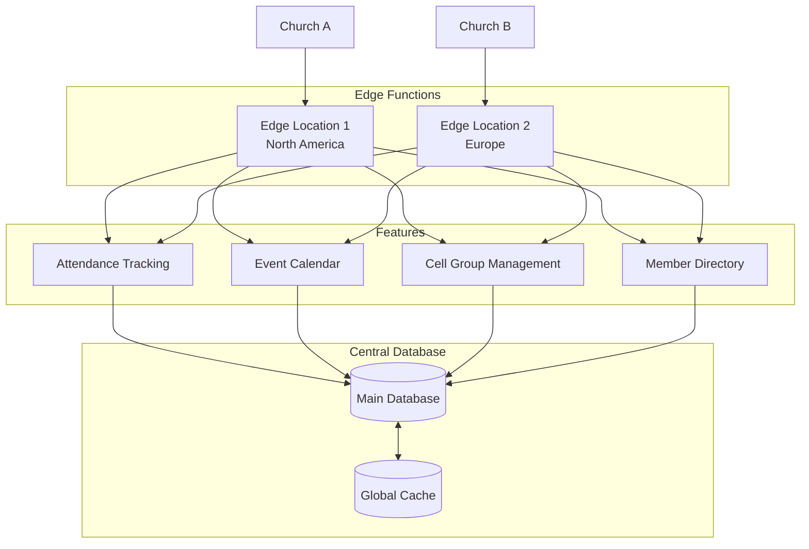

### Integration Points

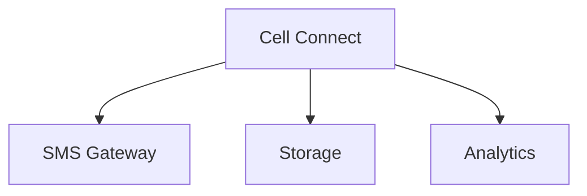

### Performance Considerations

| Component | SLA    | Scaling Strategy |
| --------- | ------ | ---------------- |
| API       | 99.9%  | Edge Functions   |
| Database  | 99.99% | Automated        |
| Cache     | 99.9%  | Memory-based     |

### Monitoring

```typescript
interface Metrics {
    performance: {
        apiLatency: number;
        cacheHitRate: number;
        syncDelay: number;
    };
    reliability: {
        uptime: number;
        errorRate: number;
        syncFailures: number;
    };
}
```

## Core Features

### 1. Attendance Management

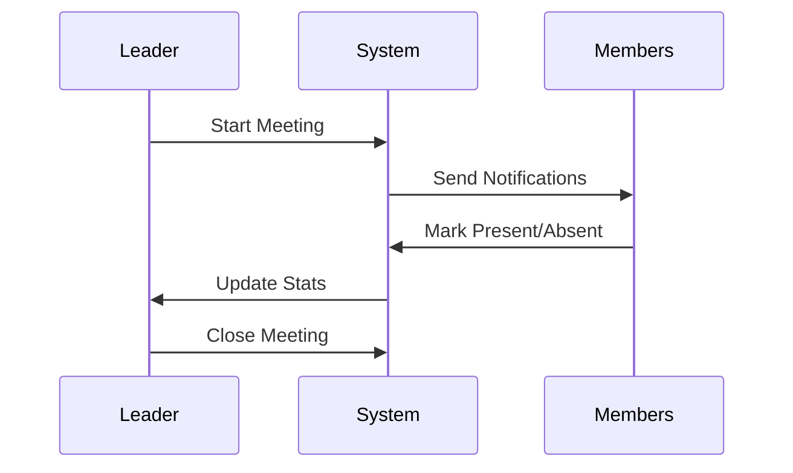

-   Simple present/absent marking
-   Automated notifications
-   Historical tracking

### 2. Member Registration

```typescript
type Member = {
    id: string;
    name: string;
    phone: string;
    status: 'active' | 'inactive';
    joinDate: Date;
    cell: string;
    leadership: 'member' | 'temp' | 'leader';
};
```

### 3. Temporary Leadership

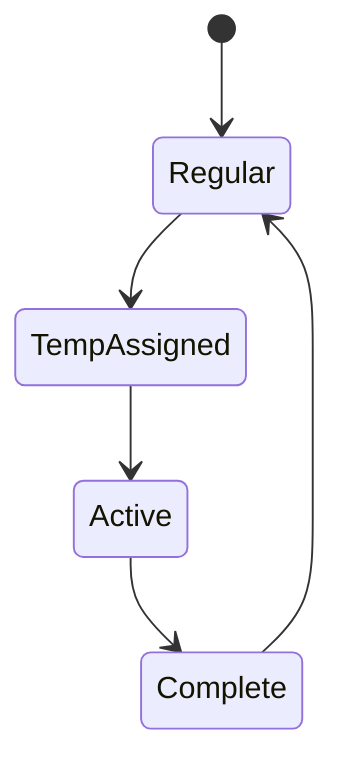

### 4. Bible Study Resources

```typescript
type StudyGuide = {
    id: string;
    title: string;
    date: Date;
    content: string;
    access: 'all' | 'leaders';
    attachments: string[];
};
```

### 5. Announcements

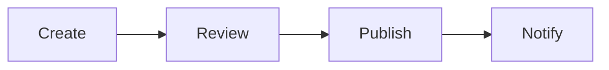

### 6. Giving System

```typescript
type Transaction = {
    id: string;
    memberId: string;
    amount: number;
    type: 'tithe' | 'offering' | 'special';
    date: Date;
    method: 'cash' | 'mobile';
};
```

### 7. Prayer Requests

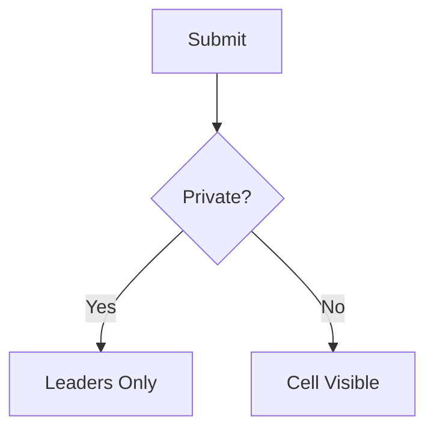

### 8. Leader Chat

```typescript
interface Chat {
    directMessage: {
        sender: string;
        recipient: string;
        content: string;
        timestamp: Date;
    };
    groupChat: {
        cellId: string;
        leadersOnly: boolean;
        messages: Message[];
    };
}
```

### Access Control Matrix

| Feature     | Admin  | Leader | Temp    | Member |
| ----------- | ------ | ------ | ------- | ------ |
| Attendance  | Full   | Manage | Record  | Self   |
| Members     | Full   | View   | View    | Self   |
| Study Guide | Manage | Access | Access  | View   |
| Giving      | Full   | Record | Record  | Self   |
| Chat        | Full   | Full   | Limited | Basic  |

### Data Flow

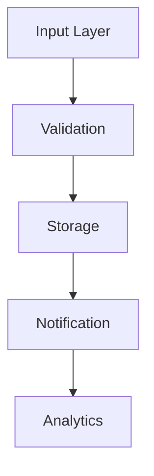

### Integration Points

```typescript
interface Integrations {
    sms: SMSGateway;
    storage: FileStorage;
    analytics: AnalyticsEngine;
}
```

## User Flows

### Weekly Cell Meeting Flow

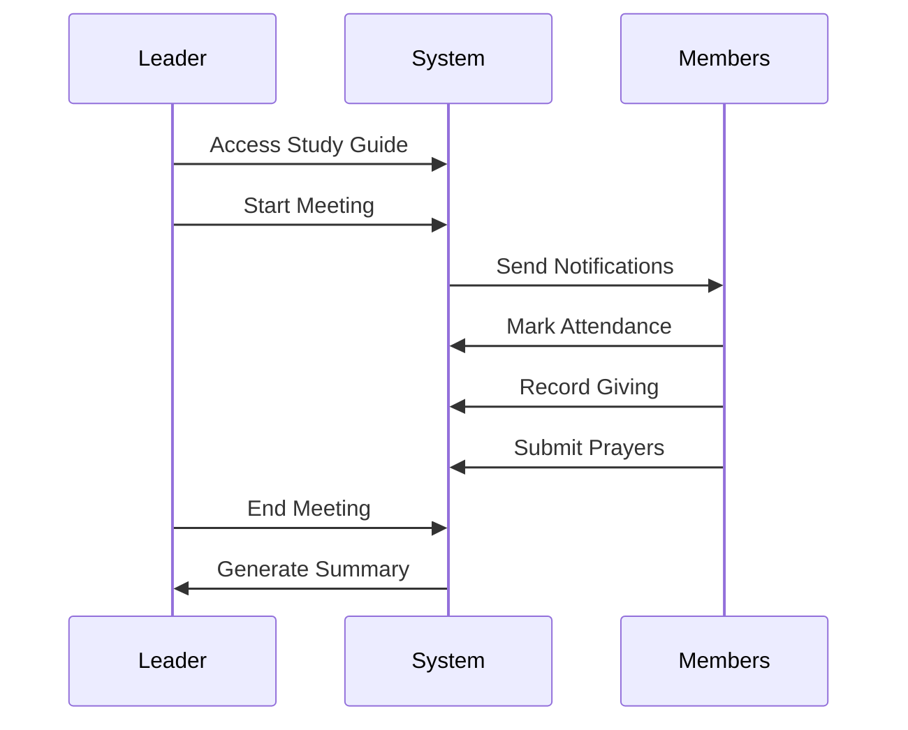

### Temporary Leadership Flow

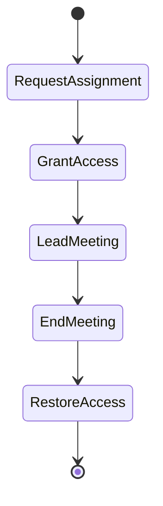

### Member Registration Flow

```mermaid
graph TD
    A[Start Registration] --> B[Basic Info]
    B --> C[Verify Phone]
    C --> D[Cell Assignment]
    D --> E[Complete]
```

### Prayer Request Flow

```mermaid
sequenceDiagram
    Member->>System: Submit Prayer
    System->>Member: Privacy Options
    Member->>System: Set Visibility
    System->>Leaders: Notify Leaders
    opt Public Prayer
        System->>Cell: Notify Cell
    end
```

### Transaction Recording Flow

```mermaid
graph LR
    A[Input Amount] --> B[Select Type]
    B --> C[Choose Method]
    C --> D[Confirm]
    D --> E[Receipt]
```

### Announcement Flow

```mermaid
sequenceDiagram
    Leader->>System: Create Announcement
    System->>Leader: Preview
    Leader->>System: Set Urgency
    System->>Members: Notify
    System->>Leader: Track Views
```

### Access Rights Progression

```mermaid
graph TD
    A[Member] --> B[Active Member]
    B --> C[Temp Leader]
    C --> D[Cell Leader]
```

### Error Flows

```typescript
type ErrorFlow = {
    type: 'validation' | 'network' | 'permission';
    retry: boolean;
    fallback: string;
    recovery: () => void;
};
```

### Success States

```typescript
type SuccessState = {
    action: string;
    confirmation: 'notification' | 'email' | 'sms';
    next: string[];
};
```

## Data Models

### Core Entities

```mermaid
erDiagram
    CELL ||--o{ MEMBER : contains
    CELL ||--o{ MEETING : has
    MEMBER ||--o{ ATTENDANCE : marks
    MEMBER ||--o{ TRANSACTION : makes
    MEMBER ||--o{ PRAYER : submits
    MEETING ||--o{ ATTENDANCE : records
    MEETING ||--o{ TRANSACTION : collects
```

### Schema Definitions

```typescript
interface Cell {
    id: string;
    name: string;
    leaderId: string;
    tempLeaderId?: string;
    location: string;
    meetingDay: string;
    meetingTime: string;
    status: 'active' | 'inactive';
}

interface Member {
    id: string;
    cellId: string;
    name: string;
    phone: string;
    joinDate: Date;
    status: 'active' | 'inactive';
    role: 'member' | 'temp' | 'leader';
    lastAttendance: Date;
}

interface Meeting {
    id: string;
    cellId: string;
    date: Date;
    leaderId: string;
    studyGuideId: string;
    status: 'scheduled' | 'active' | 'completed';
    attendance: number;
    transactions: number;
}

interface Attendance {
    id: string;
    meetingId: string;
    memberId: string;
    status: 'present' | 'absent';
    timestamp: Date;
}

interface Transaction {
    id: string;
    meetingId: string;
    memberId: string;
    amount: number;
    type: 'tithe' | 'offering' | 'special';
    method: 'cash' | 'mobile';
    timestamp: Date;
}

interface Prayer {
    id: string;
    memberId: string;
    content: string;
    isPrivate: boolean;
    status: 'active' | 'answered';
    timestamp: Date;
}

interface StudyGuide {
    id: string;
    title: string;
    content: string;
    date: Date;
    attachments: string[];
    access: 'all' | 'leaders';
}

interface Message {
    id: string;
    senderId: string;
    recipientId?: string;
    cellId?: string;
    content: string;
    type: 'direct' | 'group';
    timestamp: Date;
}
```

### Database Indexes

```sql
-- Performance Indexes
CREATE INDEX idx_member_cell ON members(cell_id);
CREATE INDEX idx_attendance_meeting ON attendance(meeting_id);
CREATE INDEX idx_transaction_date ON transactions(timestamp);

-- Search Indexes
CREATE INDEX idx_member_phone ON members(phone);
CREATE INDEX idx_prayer_content ON prayers USING GIN (content);
```

### Relations & Constraints

```sql
-- Foreign Keys
ALTER TABLE members
ADD CONSTRAINT fk_cell
FOREIGN KEY (cell_id)
REFERENCES cells(id);

-- Check Constraints
ALTER TABLE transactions
ADD CONSTRAINT valid_amount
CHECK (amount > 0);

-- Unique Constraints
ALTER TABLE members
ADD CONSTRAINT unique_phone
UNIQUE (phone);
```

### Access Policies

```sql
-- Row Level Security
ALTER TABLE cells ENABLE ROW LEVEL SECURITY;

CREATE POLICY cell_access ON cells
FOR SELECT
USING (
    auth.uid() IN (
        SELECT member_id FROM cell_members
        WHERE cell_id = cells.id
    )
);
```

## Support

-   Contact Information
-   Common Issues
-   Training Resources
