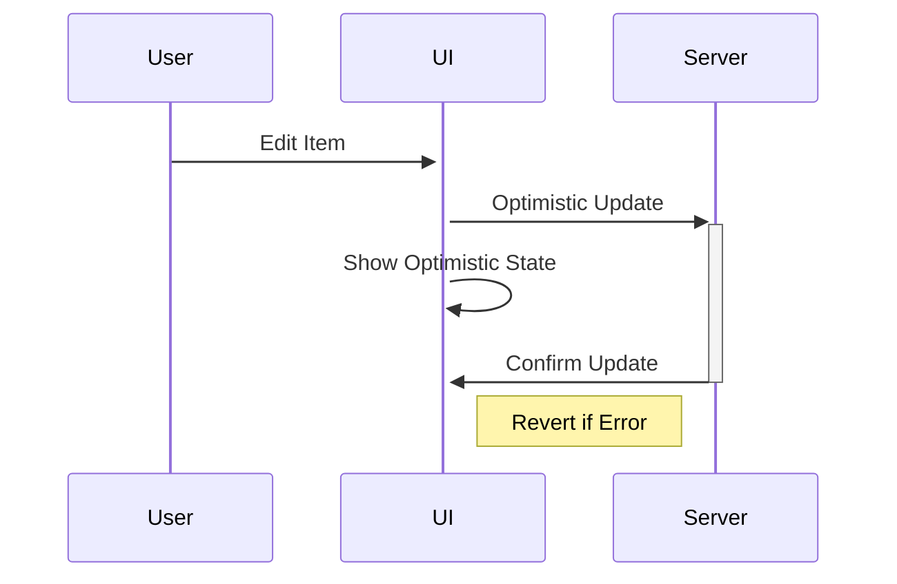

# Simple CRUD Pattern 🛠️

## Overview

A lightweight pattern for managing simple configuration lists and settings in Remix applications. Perfect for:

-   Categories
-   Settings
-   Tags
-   Month configurations
-   Status types



## Implementation

### 1. Core Component

```typescript
// components/blocks/simple-crud-list.tsx
interface SimpleListProps<T extends { id: string; name: string }> {
    title: string;
    items: T[];
    createSchema: z.ZodSchema;
    editSchema: z.ZodSchema;
    isLoading?: boolean;
}

export function SimpleCrudList<T extends { id: string; name: string }>(
    props: SimpleListProps<T>
) {
    const fetcher = useFetcher();

    // Get optimistic data
    const currentItems = fetcher.formData
        ? getOptimisticItems(props.items, fetcher.formData)
        : props.items;

    return (
        <Card>
            <CardHeader className="flex justify-between">
                <CardTitle>{props.title}</CardTitle>
                <Button onClick={() => setShowCreate(true)}>
                    <Plus className="mr-2 h-4 w-4" /> Add New
                </Button>
            </CardHeader>

            <CardContent>
                {currentItems.map((item) => (
                    <SimpleListItem
                        key={item.id}
                        item={item}
                        onEdit={(values) => {
                            fetcher.submit(
                                { ...values, id: item.id },
                                { method: 'post' }
                            );
                        }}
                    />
                ))}
            </CardContent>

            <CreateDialog
                schema={props.createSchema}
                onSubmit={(values) => {
                    fetcher.submit(
                        { ...values, action: 'create' },
                        { method: 'post' }
                    );
                }}
            />
        </Card>
    );
}
```

### 2. Route Implementation

```typescript
// routes/settings.categories.tsx
import { SimpleCrudList } from '~/components/blocks/simple-crud-list';

export async function loader() {
    return json({
        items: await db.category.findMany(),
    });
}

export async function action({ request }: ActionArgs) {
    const formData = await request.formData();
    const action = formData.get('action');

    try {
        switch (action) {
            case 'create':
                const created = await db.category.create({
                    data: createSchema.parse(formData),
                });
                return json(created);

            case 'update':
                const updated = await db.category.update({
                    where: { id: formData.get('id') },
                    data: editSchema.parse(formData),
                });
                return json(updated);

            case 'delete':
                await db.category.delete({
                    where: { id: formData.get('id') },
                });
                return json({ success: true });
        }
    } catch (error) {
        return json({ error: 'Failed to process request' }, { status: 400 });
    }
}

export default function CategoriesRoute() {
    const { items } = useLoaderData<typeof loader>();

    return (
        <SimpleCrudList
            title="Categories"
            items={items}
            createSchema={createSchema}
            editSchema={editSchema}
        />
    );
}
```

### 3. Validation Schemas

```typescript
// schemas/category.ts
import { z } from 'zod';

export const createSchema = z.object({
    name: z.string().min(1, 'Name is required'),
    type: z.enum(['income', 'expense']),
    isActive: z.boolean().default(true),
});

export const editSchema = createSchema.partial();
```

## 🎯 Features

### 1. Optimistic Updates

```typescript
function getOptimisticItems(items: Item[], formData: FormData) {
    const action = formData.get('action');
    const id = formData.get('id');
    const name = formData.get('name');

    switch (action) {
        case 'create':
            return [...items, { id: 'temp', name }];
        case 'update':
            return items.map((item) =>
                item.id === id ? { ...item, name } : item
            );
        case 'delete':
            return items.filter((item) => item.id !== id);
        default:
            return items;
    }
}
```

### 2. Inline Editing

```typescript
function SimpleListItem({ item, onEdit }) {
    const [isEditing, setIsEditing] = useState(false);

    if (isEditing) {
        return (
            <Form
                onSubmit={async (values) => {
                    await onEdit(values);
                    setIsEditing(false);
                }}
            >
                <Input name="name" defaultValue={item.name} autoFocus />
            </Form>
        );
    }

    return (
        <div className="flex justify-between items-center p-2">
            <span>{item.name}</span>
            <Button onClick={() => setIsEditing(true)}>
                <Pencil className="h-4 w-4" />
            </Button>
        </div>
    );
}
```

### 3. Loading States

```typescript
// Global pending UI
export function GlobalPending() {
    const navigation = useNavigation();

    return navigation.state !== 'idle' ? (
        <div className="fixed top-0 left-0 right-0 h-1">
            <div className="h-full bg-primary animate-progress" />
        </div>
    ) : null;
}
```

## 🎨 Styling Examples

### 1. List Styles

```typescript
<div className="divide-y divide-gray-200 dark:divide-gray-800">
    {items.map((item) => (
        <div
            key={item.id}
            className="flex items-center justify-between p-4 group hover:bg-accent"
        >
            <div className="flex items-center gap-4">
                <div className="w-2 h-2 rounded-full bg-primary" />
                <span>{item.name}</span>
            </div>
            <div className="opacity-0 group-hover:opacity-100 transition-opacity">
                <ActionButtons item={item} />
            </div>
        </div>
    ))}
</div>
```

### 2. Animation

```typescript
<div
    className={cn(
        'transition-all duration-200',
        isEditing ? 'scale-105 shadow-lg' : 'scale-100'
    )}
>
    {/* Item content */}
</div>
```

## 🔧 Error Handling

```typescript
function handleSubmit(values: FormData) {
    try {
        // Show optimistic update
        setItems(getOptimisticItems(items, values));

        // Attempt update
        await submitUpdate(values);
    } catch (error) {
        // Revert on failure
        setItems(originalItems);
        toast.error('Failed to update');
    }
}
```

## 📈 Best Practices

1. **Always Validate Both Client & Server**

```typescript
// Client
const formData = await validateSchema(data);

// Server
try {
    const validated = schema.parse(await request.formData());
} catch (error) {
    return json({ error: error.format() }, { status: 400 });
}
```

2. **Handle Loading States**

```typescript
<Button disabled={fetcher.state !== 'idle'}>
    {fetcher.state === 'submitting' ? 'Saving...' : 'Save'}
</Button>
```

3. **Provide Clear Feedback**

```typescript
useEffect(() => {
    if (fetcher.data?.error) {
        toast.error(fetcher.data.error);
    } else if (fetcher.data?.success) {
        toast.success('Changes saved!');
    }
}, [fetcher.data]);
```
